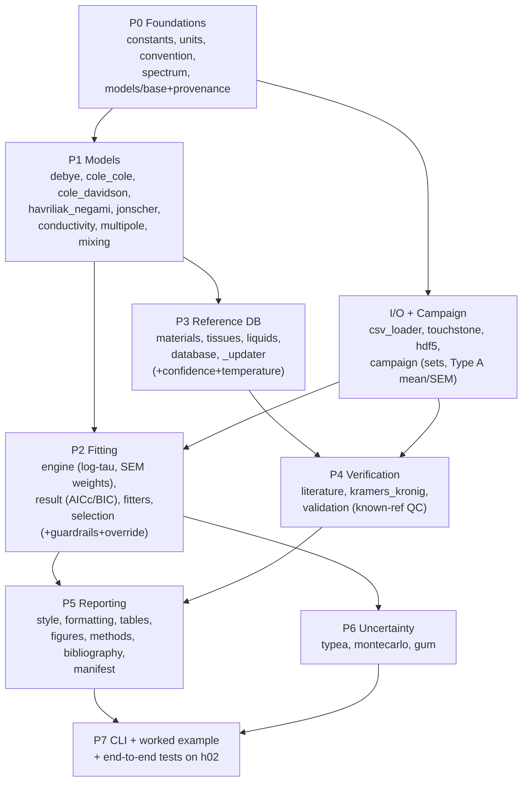

# Plan (refined): Dielectric Spectroscopy Toolkit — core library (`dielectric`)

> **Status:** review-ready refinement of `PLAN.md`. Supersedes it — keeps every decision and the
> module layout, and adds the scientific rigour, build order, and risk register needed to execute
> without follow-up questions. Where this document changes or adds to `PLAN.md`, the delta is marked
> **REFINEMENT**.

---

## 1. Context & confirmed decisions

`STACK.md`, `WHAT-IT-DOES.md`, `data/`, and `.claude/` are all that remain on disk; the Python
package described in project memory no longer exists. This is a **from-scratch recreation of the
core library** plus three requirements: (1) multi-set upload (a "set" = a repeatability group of
repeat files for one sample; load any number of measurement *and* validation sets), (2) auto
model-selection with override (best model **and number of poles**, recommended but overridable),
(3) an embedded literature reference library with **biological-tissue emphasis** for comparison.

**Confirmed decisions (carried from `PLAN.md`):**
- **Scope this pass: core Python library only** (the permanent asset). Web UI (FastAPI/React or
  Streamlit), PostgreSQL, Docker are deferred to a follow-up pass.
- **Validation = known-reference QC check.** A validation set is repeat measurements of a *known
  reference material*; we confirm the probe/inversion is trustworthy by comparing the set's mean
  spectrum to that material's literature model. No validation set → campaign flagged **"not
  validated."**
- **Network is blocked here**, so the reference database ships as an **embedded, citation-tagged
  snapshot** with a per-value confidence flag (`HIGH` / `VERIFY`), plus a documented (not-run)
  `_updater` hook to refresh from IFAC Appendix C / NPL MAT 23 when online. We never ship invented
  precision — `VERIFY` values are flagged in every output.

**Intended outcome:** a typed, tested, CI-gated `dielectric` package where a PhD student goes
load → quality-check → (auto) fit → verify (literature + KK + reference QC) → uncertainty →
publication-ready export, reproducibly, from the `h02` data, via a CLI and a narrated worked example.

> **REFINEMENT — data-identity assumption to confirm.** `PLAN.md` (and the worked example) assume
> `data/h02s19m*.csv` (15 files) is the **measurement set** and `data/h02v*.csv` (25 files) is the
> **validation set** of a known saline/water reference. Both file groups are saline/water-like
> (ε′ ≈ 83 near 200 MHz, falling to ≈ 41 at 20 GHz; effective conductivity ≈ **1.7 S/m** from the
> low-frequency loss — verified from `h02v01.csv`: `σ = ε″·ω·ε₀ = 153.4 × 2π·2e8 × 8.854e-12`).
> Because this mapping drives the worked example and the QC verdict, the domain owner must confirm
> which group is the sample and which is the reference, and **which reference material** the
> validation set actually is. Treated as an explicit, flagged assumption until confirmed.

---

## 2. Sign convention (replicate exactly — pervasive)

Engineering `e^{jωt}`: `ε* = ε′ + j·Im(ε*)` with **`Im(ε*) < 0` for lossy media**. Internally store
ε* with a **negative imaginary part**. Downstream: `σ_eff = −ω·ε₀·Im(ε*)` (positive for a passive
lossy medium); KK formulas carry the flipped sign; Cole-Cole plots show `−Im(ε*)`.

> **REFINEMENT — detection rule, explicit & testable.** The Agilent 85070 export stores **positive**
> loss (the `(e'')` column is ≥ 0). `convention.py` exposes one function that takes the raw
> imaginary column and returns `(corrected, ConventionWarning | None)`:
> - if `median(Im) > 0` → source uses the physics/"positive-loss" convention → **negate once and
>   emit a `ConventionWarning`** (the loader never silently "fixes" data);
> - if `median(Im) < 0` → already internal convention → pass through, no warning;
> - `median(Im) ≈ 0` (no loss) → pass through with an informational note.
> Passive media never have net gain, so the median test is unambiguous for this domain. This is a
> unit-testable function and is the **only** place sign correction happens.

> **REFINEMENT — internal vs displayed sign boundary.** Internal storage is `Im(ε*) < 0`, but the
> **reporting layer displays the conventional positive `ε″ = −Im(ε*)`** so figures, tables, and
> methods text match the literature. State and test this boundary so no negative imaginary value
> ever leaks into a published artifact, and so KK / Cole-Cole plotting consistently uses `−Im`.

---

## 3. Package layout

```
pyproject.toml            # package metadata, deps, ruff/mypy/pytest config
.github/workflows/ci.yml  # lint + type + test gates
README.md                 # front door = narrated worked example (not API ref)
dielectric/
  __init__.py             # public API + __version__
  constants.py            # ε₀ and physical constants
  units.py                # typed units at I/O boundary (Hz/GHz, rel/abs permittivity) + conversions
  convention.py           # sign-convention detection + warnings (Section 2)
  spectrum.py             # Spectrum value object (f, eps_complex, band, metadata) + quality pass
  models/
    base.py               # DielectricModel ABC: epsilon(f)->complex, params, provenance, n_params
    provenance.py         # Citation/Provenance/Confidence value objects
    debye.py  cole_cole.py  cole_davidson.py  havriliak_negami.py  jonscher.py
    conductivity.py       # DC ionic conductivity term (composable)
    multipole.py          # MultiPoleRelaxation: sum of N Cole-Cole terms (+ optional DC σ) = "poles"
    mixing.py             # Maxwell-Garnett, Bruggeman, Looyenga (compose DielectricModel)
  fitting/
    engine.py             # generic NLLS on stacked re/im residuals; log_scale τ, SEM weighting, covariance
    result.py             # FitResult: params±u, residuals, GoF, AIC/BIC/AICc, provenance, manifest
    fitters.py            # fit_debye, fit_cole_cole, fit_cole_cole_conductivity, fit_multipole, ...
    selection.py          # auto model-selection + overparameterization guardrails + override API
  reference/
    materials.py          # ReferenceMaterial = preconfigured model instance + provenance + confidence + temperature
    tissues.py            # Gabriel/IT'IS tissues (microwave 2-Cole-Cole restriction)
    liquids.py            # water (Kaatze), saline (Stogryn/Peyman), seawater, methanol/ethanol
    database.py           # registry + query/search API (filter by class, e.g. "tissue")
    _updater.py           # network-gated refresh hook (documented, not run)
  verification/
    literature.py         # compare a fit/spectrum against reference materials (distance metrics)
    kramers_kronig.py     # KK consistency + residuals; model-tail-assisted; band-limit warning
    validation.py         # known-reference QC: validation set vs literature -> validated/not-validated
  uncertainty/
    typea.py              # Type A repeat statistics across a set (mean spectrum + SEM)
    montecarlo.py         # MC propagation through an arbitrary user callable (seeded)
    gum.py                # GUM/JCGM-100 budget engine + templates + input-uncertainty injection
  io/
    csv_loader.py         # Agilent 85070 loader + parameterized generic CSV (col idx/header/comment)
    touchstone.py         # .s1p
    hdf5.py               # optional (h5py)
    campaign.py           # MeasurementSet / ValidationSet / Campaign — multi-set loading + metadata schema
  dependence.py           # Arrhenius, VFT, concentration fits
  reporting/
    style.py              # one centralized publication plotting style
    formatting.py         # GUM significant-figure rounding (value ± uncertainty)
    tables.py             # paper-ready LaTeX + CSV tables
    figures.py            # captioned, provenance-stamped figures
    methods.py            # methods-paragraph generator
    bibliography.py       # BibTeX export of cited provenance
    manifest.py           # reproducibility manifest (input hash, version, settings, seed, timestamp)
  cli.py                  # `dielectric analyze ...` end-to-end
examples/worked_example.py + .md   # narrated end-to-end on the h02 data
tests/                    # pytest mirror of modules
```

> **REFINEMENT — architectural tightening.**
> - `spectrum.py`'s `Spectrum` is the **single value object every layer consumes** (fitting,
>   verification, uncertainty, reporting). It carries `metadata` including `temperature` (Section 4b).
> - Sign-convention detection (`convention.py`) is invoked **only inside the `io/` boundary**, so by
>   the time a `Spectrum` exists it is guaranteed to be in internal convention. Nothing downstream
>   re-checks sign.
> - Everything downstream is written against the `DielectricModel` ABC, never concrete classes, so
>   reference materials (pre-configured instances) compose with fitting/comparison/uncertainty
>   identically.

A per-module **depends-on / blocks** view is the build DAG in Section 7.

---

## 4. Science deep-dives (the core of the refinement)

### 4a. Model selection — rigorous and identifiability-aware

**Candidate set.** Debye, Cole-Cole, Cole-Davidson, Havriliak-Negami (HN), Jonscher universal
response, and `MultiPole(N=1,2,3)` — each **with and without** a DC conductivity term. For the `h02`
saline data the expected winner is **Cole-Cole + DC conductivity** (the low-frequency loss is
σ-dominated; memory notes ΔAIC ≈ 700 vs pure relaxation).

> **REFINEMENT — likelihood basis stated explicitly.** Type A SEM is treated as known σ, so fits
> use **weighted χ²** and the information criteria are:
> - `AIC  = χ²_w + 2k`
> - `AICc = AIC + 2k(k+1)/(N − k − 1)`
> - `BIC  = χ²_w + k·ln(N)`
>
> where `k = n_params` and **`N` is the number of stacked _real_ residuals = `2 · n_freq`** because
> residuals stack `[Re(resid), Im(resid)]`. This `N` convention must be **identical across all
> candidates** — it sets the small-sample AICc penalty and a per-model inconsistency would silently
> corrupt the ranking. `selection.py` exposes the full ranking table (model, k, χ²_red, AIC, AICc,
> BIC, ΔAICc).

> **REFINEMENT — nesting made explicit (guardrail logic).** HN nests Cole-Cole (β = 1) and
> Cole-Davidson (α = 0); `MultiPole(N=1, α=0)` = Debye; `N=1` = Cole-Cole. Guardrail: **prefer the
> nested special case unless `ΔAICc ≳ 2`** favors the richer model, and **fail loud** when `k` is
> large versus the data (e.g. HN or 3-pole on too few points) or when an added term does not beat
> ΔAICc ≳ 2. Over-parameterized fits are warned, not silently returned.

> **REFINEMENT — identifiability risk (new, important).** Water's principal relaxation is
> `f_relax = 1/(2πτ) ≈ 17–19 GHz`, sitting at the **top edge** of the 0.2–20 GHz band. Consequently
> **ε∞ and τ are strongly correlated and ε∞ is poorly constrained** from these data. Mitigations,
> all reported, not hidden:
> 1. report the **ε∞–τ covariance / correlation** in `FitResult` and flag high correlation;
> 2. **seed ε∞ from the high-frequency ε′** (Section init heuristics);
> 3. allow ε∞ to be **fixed or tightly bounded** when its confidence interval comes back
>    unphysically wide, and note the constraint in the manifest.

> **REFINEMENT — initial-guess heuristics + multistart (new).** NLLS is non-convex; `PLAN.md`
> covered only log-τ scaling. Document and implement deterministic starting values:
> - `σ_DC` from the low-frequency loss: `σ ≈ ε″·ω·ε₀` at the lowest frequencies;
> - `ε_s` from the low-frequency ε′ **after** removing the σ contribution;
> - `ε∞` from the high-frequency ε′ plateau;
> - `τ` from the loss-peak frequency (`τ ≈ 1/(2π f_peak)`), in log10 space.
>
> Wrap the fit in a **small multistart** (a few perturbed seeds) and keep the best χ²_w, to avoid
> local minima. This closes the convergence-robustness gap.

**Fitting engine.** scipy `least_squares` on stacked `[Re(resid), Im(resid)]`; **τ optimized in
log10 space** (a finite-difference Jacobian floor destroys the τ column otherwise) — bounds
transformed to log space, covariance mapped back via the delta method (`dx/dz = ln(10)·x`); fits
weighted by Type A SEM (`sigma=`) so reduced χ² is physical.

**Override API.** `select_model(spectrum, force_model=..., n_poles=...)` returns the chosen fit while
**still reporting where it ranks**, so an override is informed, not blind.

### 4b. Reference DB — temperature, confidence semantics, principled tissue restriction

> **REFINEMENT — temperature matching (new, high-impact).** Every `ReferenceMaterial` carries a
> `temperature` attribute; water/saline ε_s varies ≈ **−0.4 per °C**, so comparing a ~22 °C
> measurement against a 25 °C model injects a systematic deviation that can **fail QC spuriously**.
> Therefore:
> - add `temperature` to `Spectrum.metadata` and to the campaign metadata schema;
> - `literature.py` / `validation.py` **warn on a temperature mismatch** and surface ΔT in the
>   comparison;
> - the `h02` exports carry **no temperature** in their headers (only a date), so T is a documented
>   campaign field with an explicit **"unknown → widened QC tolerance"** path rather than a silent
>   default.

> **REFINEMENT — confidence-flag definitions (tightened).** `Confidence = {HIGH, VERIFY}`:
> - `HIGH` = value transcribed directly from the **primary source with a DOI**, with the model
>   equation reproduced and unit-checked;
> - `VERIFY` = derived, secondary-sourced, or otherwise unconfirmed.
>
> Every table, figure caption, and report renders the flag; **`VERIFY` numbers are never cited
> bare** — a student cannot unknowingly publish an unconfirmed value. `Provenance` carries
> authors / year / journal / DOI plus license attribution.

**Tissues** (Gabriel 1996 / IT'IS, CC BY): blood, muscle, skin, fat, liver, brain grey/white, bone,
kidney, lung, breast, heart.

> **REFINEMENT — tissue 2-Cole-Cole restriction made principled.** The full Gabriel model is a
> **4-Cole-Cole** dispersion (α, β, γ, δ) plus σ. We embed the **2 terms (+ ε∞ + σ) that dominate
> 0.2–20 GHz** (the γ/δ dispersions with ps–ns relaxation times); the µs–ms α-dispersion terms are
> **documented-as-dropped**, not invented. The reduction is not asserted — `tissues.py` ships a
> **restriction-error check** that compares the 2-term embedded model against the published full
> 4-term model over the band and **asserts max deviation < a stated tolerance (target ≲ 1–2 %)**,
> recorded as a test. Attribution text (Gabriel/IT'IS CC BY) ships with the data.

**Liquids:** water (Kaatze 1989), saline (Stogryn 1971 / Peyman 2007), seawater (Klein–Swift),
methanol/ethanol (NPL MAT 23). `HIGH` values shipped as trusted; `VERIFY` flagged in any output.

**Query API.** `database.query(material_class="tissue")` etc. `_updater.py` documents refreshing
from IFAC Appendix C / NPL MAT 23 when network is available (**not executed** this pass).

### 4c. Multi-set / validation — define the statistics and QC, not just the API

`MeasurementSet`: a sample id + list of repeat spectra → Type A mean + SEM. `ValidationSet`: same,
plus the **reference material id** it measures. `Campaign`: any number of measurement sets + any
number of validation sets + a typed/validated metadata schema. Glob loading:
`MeasurementSet.from_glob("data/h02s19m*.csv")`,
`ValidationSet.from_glob("data/h02v*.csv", reference="saline")`.

> **REFINEMENT — grid alignment.** Repeats must share a frequency grid. The loader **asserts the
> grids are identical** across a set (the `h02` files all use the same 200 MHz–20 GHz grid); on a
> mismatch it **errors** by default, or **interpolates onto a common grid with a warning** if the
> caller opts in. No silent resampling.

> **REFINEMENT — mean / SEM definition.** Compute the mean complex ε across repeats; compute the
> **SEM per frequency on ε′ and ε″ separately** (`SEM = std / √n`). These per-component SEMs are the
> weights handed to the fit (`sigma=`), tying directly to 4a's known-σ likelihood.

> **REFINEMENT — repeat-outlier policy (new).** A set-level screen runs before averaging: a repeat
> whose per-frequency deviation from the set **median exceeds `k · MAD`** (robust, default `k`
> stated) is **flagged and excluded**, with the exclusion and reason recorded in the report
> (catches a bad probe contact in one file without hand-editing data).

> **REFINEMENT — QC verdict definition (sharpened).** `validation.py` compares the validation-set
> mean to its declared reference model **over the band overlap, temperature-matched**. Because the
> low-frequency ε″ is σ-dominated and large, a single ε″ relative-RMS would be dominated by
> conduction and is misleading; instead **assess ε′ and σ_DC separately** (and/or
> uncertainty-weighted residuals), each against a defensible default tolerance tied to combined
> probe + literature uncertainty (e.g. ~5 % in ε′; wider, separately stated, for σ). The QC produces
> a pass/fail verdict the manifest and reports carry.

> **REFINEMENT — `campaign.validated` semantics (decision flagged).** `PLAN.md` said "validated if
> ≥1 validation set passes." Recommend the **stricter rule: validated only if _all_ declared
> validation sets pass**; per-set verdicts are reported regardless. If no validation set is present,
> the campaign and all exports are stamped **"NOT VALIDATED."** (Final ≥1-vs-all choice to be
> confirmed with the domain owner.)

### 4d. Kramers-Kronig — avoid the naive finite-band trap

> **REFINEMENT.** A finite-band Hilbert transform is **biased** because the KK integral runs
> `0 → ∞`. Rather than a naive band-limited transform, `kramers_kronig.py` computes a KK
> **consistency residual using the fitted model to supply the out-of-band tail** (equivalently,
> singly-subtractive KK to suppress out-of-band sensitivity), and **reports a truncation-error
> estimate**. The band-limited-extrapolation **warning is retained**. Correctness is pinned by a
> unit test against **Debye's closed-form KK pair** (analytic ε′/ε″ relationship), so the transform
> is verified independently of the real data.

### 4e. Uncertainty — reproducibility & a concrete GUM template

- **Type A:** repeat statistics across a set → mean spectrum + SEM (Section 4c).
- **Monte Carlo:** propagation through an arbitrary user callable.

> **REFINEMENT — MC reproducibility.** `montecarlo.py` takes a **recorded seed**, a default sample
> count, and runs a **convergence check** (result stable as N grows); the **seed is stored in the
> manifest** so any MC figure regenerates bit-for-bit.

> **REFINEMENT — GUM budget template (new).** `gum.py` ships a default coaxial-probe permittivity
> budget skeleton enumerating the standard contributors so "input-uncertainty injection" is
> concrete: **Type A repeatability**, **probe-calibration / Type B**, **temperature**, and
> **model-fit (parameter) uncertainty**. Users fill magnitudes; the engine combines them per
> JCGM-100.

---

## 5. Gaps & risks register

| # | Risk | Impact if unaddressed | Mitigation (where in plan) |
|---|------|----------------------|----------------------------|
| 1 | Sign convention mis-detected | σ_eff sign, KK, plots all wrong | Median-of-Im rule, warn-not-fix, single function, unit test (§2) |
| 2 | ε∞–τ correlated (relaxation at band edge) | ε∞ unconstrained, misleading CIs | Report covariance, seed ε∞ from high-f, allow fix/bound (§4a) |
| 3 | Temperature mismatch ref vs measurement | Spurious QC failure / bad comparison | `temperature` attr, mismatch warning, unknown→widened tolerance (§4b) |
| 4 | σ-dominated low-f ε″ skews QC | False pass/fail on validation | Assess ε′ and σ_DC separately, uncertainty-weighted (§4c) |
| 5 | KK truncation bias (finite band) | False "non-causal" verdicts | Model-tail / subtractive KK + truncation estimate; Debye analytic test (§4d) |
| 6 | NLLS local minima | Wrong "best fit", unstable selection | Init heuristics + multistart + log-τ (§4a) |
| 7 | Overparameterization | Spurious "best" complex model | AICc/BIC + nesting + ΔAICc≳2 guardrail, fail loud (§4a) |
| 8 | Data-identity assumption (which group is reference) | Worked example / QC built on wrong premise | Flagged for owner confirmation (§1) |
| 9 | Tissue 4→2 Cole-Cole reduction error | Embedded model silently inaccurate | Restriction-error check < tolerance as a test (§4b) |
| 10 | Repeat with bad contact | Biased Type A mean/SEM | k·MAD outlier screen with reporting (§4c) |
| 11 | MC non-reproducibility | Figures not regenerable | Seed recorded in manifest, convergence check (§4e) |
| 12 | `VERIFY` value cited unknowingly | Student publishes unconfirmed number | Confidence flag rendered everywhere, never bare (§4b) |

---

## 6. Engineering standards / tooling

- `.venv` (Python 3.10) with numpy / scipy / pandas / matplotlib; pytest + pytest-cov;
  **mypy --strict**; **ruff**. h5py optional. (Matches `.claude/settings.local.json` allowlist.)
- CI (`.github/workflows/ci.yml`): ruff → mypy --strict → pytest --cov, all gated.
- Test target ≥ 90 % coverage; tests mirror modules. New/updated tests beyond `PLAN.md`:
  - **sign detection** on real `h02` (asserts the `ConventionWarning` fires on positive loss);
  - **Debye analytic KK pair** (closed-form ε′↔ε″) for `kramers_kronig.py`;
  - **tissue restriction-error** check (2-term vs 4-term < tolerance);
  - **temperature-mismatch** warning path;
  - **synthetic round-trip** recovery (Debye/Cole-Cole params recovered to ~machine precision with
    log-scaled τ), plus real-data fits on `h02`;
  - **AICc N-convention** test (penalty uses `N = 2·n_freq`).

---

## 7. Build-phase dependency order



**Milestone checkpoints** (each phase ends runnable/verifiable):
- **P1** — synthetic spectra evaluate & plot for every model.
- **P2** — synthetic round-trip recovers known params; AICc ranking table produced.
- **P3b** — `h02` loads as sets with the sign warning + Type A mean/SEM.
- **P4** — validation QC verdict produced on `h02v*` (temperature-matched).
- **P7** — full CLI run reproduces all artifacts.

---

## 8. Skills usage

Invoked where they directly improve the deliverable: **karpathy-guidelines** (surgical coding
discipline, throughout); **scientific-visualization** (`reporting/style.py` + `figures.py`);
**citation-management** (validate reference-DB DOIs + `bibliography.py` BibTeX);
**scientific-writing** (`methods.py` IMRAD-grade prose); **statistical-analysis** / **statsmodels**
(AIC/BIC model-selection reporting, Type A stats); **scientific-critical-thinking** /
**hypothesis-generation** (sanity-check which guardrail traps must fail loud). **scikit-learn**,
**seaborn**, **matlab** consulted only if a concrete need arises. **frontend-design / taste-skill /
webapp-testing / docx / pdf** belong to the deferred web-UI and document-export passes — out of
scope this pass.

---

## 9. Verification (end-to-end)

1. `python -m venv .venv`; install deps + `pip install -e .`.
2. **Worked example** (`examples/worked_example.py`) on real data:
   - Load measurement set `data/h02s19m*.csv` (15 repeats) → Type A mean + SEM; the
     sign-convention warning fires on positive loss; repeat-outlier screen runs.
   - Load validation set `data/h02v*.csv` as a known reference (saline/water) → temperature-matched
     QC verdict; campaign marked validated / not validated per the §4c rule.
   - Pre-fit quality pass (noise, outliers, sampling adequacy).
   - **Auto model-selection** → expect **Cole-Cole + DC conductivity** to win (large ΔAICc); print
     the full ranking table; demonstrate an **override** (force model + n_poles) showing its rank.
   - Verify: literature comparison vs tissue/liquid DB + model-tail KK residuals (band-limit
     warning).
   - Uncertainty: Type A + seeded Monte-Carlo + a GUM budget with input-uncertainty injection.
   - Export: GUM-rounded LaTeX + CSV table, captioned provenance-stamped figure (positive ε″ shown),
     methods paragraph, BibTeX, reproducibility manifest (incl. MC seed).
3. `dielectric analyze data/h02s19m*.csv --validate data/h02v*.csv --reference saline` (CLI) produces
   the same artifacts.
4. Gates: `ruff check`, `mypy --strict dielectric`, `pytest --cov` (≥ 90 %).

---

## 10. Out of scope this pass (explicit)
- Web UI (FastAPI + React/Streamlit), PostgreSQL, Docker — deferred to the next pass.
- Raw VNA S11 calibration/inversion — out of project scope (input is already-inverted ε*).
- Live network fetch of reference databases — embedded snapshot + documented updater hook instead.

---

## 11. Open decisions to confirm with the domain owner
1. **Data identity** (§1): which of `h02s19m*` / `h02v*` is the sample vs the reference, and which
   reference material the validation set is.
2. **`campaign.validated` rule** (§4c): all validation sets must pass (recommended) vs ≥ 1.
3. **Measurement temperature** for the `h02` campaign (§4b) — affects the QC tolerance path.
